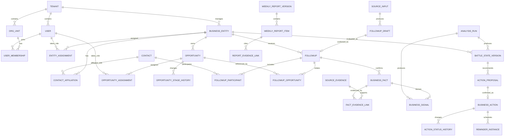

# AI 客户作战系统业务数据模型

> 状态：初步方案，待领域与技术评审
>
> 更新日期：2026-08-31
>
> 目标：基于飞书已验证闭环和专业销售管理表的结构优点，设计可查询、可追溯、可扩展的正式业务模型。本文先定义逻辑表和关系，不锁定具体数据库 DDL。

## 1. 结论先行

从专业销售管理表中已经能提炼出清晰方向：新系统不应使用一张大宽表，也不应为每个页面、人员或周报复制业务数据。建议采用：

**关系型业务核心 + 不可变历史版本 + 来源证据 + 可重建查询投影。**

业务核心围绕六组对象建立：

1. 经营对象与联系人；
2. 商机与阶段历史；
3. 原始输入、跟进草稿、正式跟进与经营事实；
4. 经营信号与作战状态版本；
5. 经营动作、状态历史与提醒；
6. 周报快照与证据引用。

Agent 运行、通知、配置、审计和导入属于支撑数据，不能与上述业务事实混成宽表。

## 2. 从专业销售管理表中学到什么

### 值得吸收

- 客户/伙伴、商机、跟进、人员和任务之间使用显式关联；
- 跟进支持跟进人、参与人、日期和不同业务类型；
- 商机阶段和季度预测/结果是不同概念；
- 待办事项有负责人、优先级、计划/实际时间、状态和工时；
- 总表、人员视图、季度看板本质上是同一事实源的不同查询视图；
- 周总结、Pipeline、业绩 Review、回款趋势等能力可以从稳定业务对象继续生长。

### 不应照搬

- 按人员复制大量独立视图；
- 把季度金额做成不断增加的固定列；
- 把公式结果、人工事实、通知标记和页面展示混在同一表；
- 每出现一种报告就新建一张事实表；
- 把飞书关联字段或自动化节点当成领域边界；
- 因为专业表覆盖订单回款，就把本项目扩成完整 CRM。

专业表为“对象关系和经营任务”提供参考；本项目仍以客户作战闭环为中心。

## 3. 三种表结构思路

### 方案 A：照搬飞书多表

优点是开发和导入快，字段容易一一对应。缺点是平台公式、自动化和视图语义会渗入后端；版本、证据、权限和 Agent 写入边界难以治理。适合短期 Demo，不适合本项目目标。

### 方案 B：少量宽表 + JSON 扩展

优点是早期字段变化成本低。缺点是客户、商机、联系人和跟进关系不清，查询、约束、迁移和审计会迅速变难，长期容易每次需求都解析 JSON。

### 方案 C：关系型核心 + 历史/证据/投影分离

优点是业务关系明确，查询和约束可靠，既能保留历史，也能通过投影快速支撑地图、周报和问数。代价是首期需要认真设计写入事务、版本和迁移。

**推荐方案 C。** 它最符合用户提出的长期可用、Agent 解耦、多端复用和避免反复推翻的目标。实验性字段仍可使用受模式约束的扩展列，但不能替代核心关系。

## 4. 逻辑分层

| 层次 | 作用 | 典型内容 |
|---|---|---|
| 主数据 | 回答“对象是谁、由谁负责” | 经营对象、联系人、内部用户、团队、责任关系 |
| 经营事实 | 回答“真实发生了什么” | 原始输入、确认草稿、跟进、事实、证据 |
| 经营状态 | 回答“当前判断是什么、如何变化” | 商机阶段历史、信号、作战状态版本 |
| 行动执行 | 回答“谁在什么时间做什么” | 经营动作、状态历史、提醒实例 |
| 报告快照 | 回答“当时报告了什么” | 个人/团队周报版本、报告项目、证据引用 |
| 运行支撑 | 回答“系统如何得出并投递结果” | Agent 运行、Tool 调用、规则版本、通知、审计、导入 |
| 查询投影 | 快速服务页面与问数 | 地图点位、销售工作台、管理总览、周报统计 |

查询投影可以重建，不能作为唯一事实源。

## 5. 核心关系图



说明：已经确认所有正式业务数据保留 `tenant_id` 顶层边界。V1 最终采用单企业部署、集团多组织还是完整多租户产品尚未决定；这是产品与部署策略问题，不影响当前先建立数据隔离边界。

## 6. 主数据表

### 6.1 内部组织与用户

| 逻辑表 | 主要字段 | 说明 |
|---|---|---|
| `tenants` | id、name、status | 顶层数据隔离；V1 可以只有一条，未来形态待定 |
| `org_units` | id、tenant_id、parent_id、name、type、status | 内部部门/销售团队，支持树形结构 |
| `users` | id、tenant_id、name、email/mobile、status | 内部用户，不等同于联系人 |
| `user_memberships` | user_id、org_unit_id、role_code、valid_from/to | 用户可跨团队或随时间变更角色 |
| `channel_addresses` | user_id、channel、external_user_id、status | 飞书 open_id 等外部地址单独保存 |

首期权限可简化为角色加数据范围，但业务模块只调用授权接口，不直接判断固定职位名称。

### 6.2 经营对象

| 逻辑表 | 主要字段 | 说明 |
|---|---|---|
| `business_entity_types` | code、name、rule_profile、status | 客户、渠道、伙伴、厂商等可配置类型 |
| `business_entities` | id、tenant_id、type_code、name、short_name、status、t0_flag、owner_org_unit_id、version_no | 统一外部经营组织；保留乐观锁版本 |
| `entity_assignments` | entity_id、user_id、assignment_role、valid_from/to、is_primary | 负责人、管理关注人、协同人等职责关系 |
| `external_refs` | source_system、object_type、internal_id、external_id、batch_id | 飞书/外部 CRM 映射和幂等导入 |

`entity_assignments` 不把“负责人”和“管理关注人”写死成经营对象上的多个用户列，使组织变化、多人协作和历史责任关系可保留。

### 6.3 联系人

| 逻辑表 | 主要字段 | 说明 |
|---|---|---|
| `contacts` | id、tenant_id、name、mobile/email、status、version_no | 自然人主档 |
| `contact_affiliations` | contact_id、entity_id、title、domain、influence_role、is_core、valid_from/to | 联系人所属组织与任职历史 |

使用任职关系表而不是在联系人上永久写死经营对象，可处理联系人换公司、同时关联多个组织或历史关系追溯。

## 7. 商机与阶段

| 逻辑表 | 主要字段 | 说明 |
|---|---|---|
| `opportunities` | id、entity_id、name、need_summary、estimated_amount、currency、stage_code、stage_progress、status、is_primary、expected_close_at、version_no | 保存高频查询所需当前状态，不把负责人永久绑定为单一用户列 |
| `opportunity_assignments` | opportunity_id、user_id、assignment_role、valid_from/to、is_primary、change_reason | 负责人、协同人、管理关注等带有效期的内部责任关系 |
| `opportunity_stage_history` | opportunity_id、from_stage、to_stage、from_progress、to_progress、changed_at、source_followup_id、rule_set_version、reason | 不可变阶段历史 |
| `opportunity_contact_roles` | opportunity_id、contact_id、participant_role、valid_from/to | 可选，表达客户决策人、使用人、影响人等外部联系角色 |

当前阶段放在 `opportunities` 便于列表和地图查询；每次变化同时追加历史。商机负责人通过 `opportunity_assignments` 管理，换负责人时结束旧关系并建立新关系，历史跟进和责任归属不被改写。页面需要的“当前负责人”可以作为查询投影，不作为唯一事实源。阶段规则、预测和成交结果是不同概念，不复用一个“阶段”字段表达全部状态。

季度预测、实际金额和回款在 V1 不作为核心，但未来应采用“指标类型 + 期间 + 版本”的预测/实际表，而不是每季度新增列。

## 8. 输入、跟进、事实与证据

### 8.1 原始输入与草稿

| 逻辑表 | 主要字段 | 说明 |
|---|---|---|
| `source_inputs` | id、tenant_id、source_type、source_message_id、submitted_by、raw_content_ref、received_at、idempotency_key | 保存原始消息引用和幂等来源 |
| `followup_drafts` | id、source_input_id、status、parser_run_id、candidate_payload、created_by、expires_at、confirmed_at | AI 候选，不是正式事实 |
| `draft_revisions` | draft_id、revision_no、changed_by、change_payload、changed_at | 记录用户修改候选的过程，可按风险决定 V1 是否落地 |

草稿可以使用受模式约束的结构化载荷，因为它是短生命周期候选；确认时必须转换为受约束的正式表记录。

### 8.2 正式跟进

| 逻辑表 | 主要字段 | 说明 |
|---|---|---|
| `followups` | id、entity_id、occurred_at、followup_type、summary、result_summary、submitted_by、confirmed_by、source_input_id、version_no | 一次确认后的正式销售活动 |
| `followup_participants` | followup_id、contact_id/user_id、participant_role | 客户联系人、跟进人、参与 FDE/协同人员 |
| `followup_opportunities` | followup_id、opportunity_id、is_primary | 一次沟通可关联多个商机 |
| `followup_corrections` | followup_id、supersedes_id、reason、corrected_by、corrected_at | 更正通过新记录表达，不无痕覆盖 |

专业表中的“跟进人、参与 FDE、伙伴、日期”证明多参与人和显式关联是必要的；页面上的人员筛选应基于关系查询，而不是为每个人复制视图。

已确认多商机关联属于少数但真实存在的场景。模型允许一条跟进关联多个商机；存在多个关联时必须且只能指定一个主关联商机，普通页面默认突出主关联，详情页再展示全部关联。

### 8.3 经营事实与证据

| 逻辑表 | 主要字段 | 说明 |
|---|---|---|
| `business_facts` | id、entity_id、opportunity_id、fact_type、fact_value、occurred_at、confirmed_at、confirmed_by、valid_status、supersedes_fact_id | 经确认的客观事实，可关联商机 |
| `source_evidence` | id、source_type、content_ref、excerpt、content_hash、captured_at、sensitivity | 原始消息片段、附件、导入行等来源 |
| `fact_evidence_links` | fact_id、evidence_id、relation_type | 一个事实可有多份证据，一份证据可支持多条事实 |

事实不直接保存 AI 的象限或建议。AI 判断属于经营状态，必须能引用事实和分析版本。

## 9. 信号、分析与作战状态

| 逻辑表 | 主要字段 | 说明 |
|---|---|---|
| `analysis_runs` | id、entity_id、trigger_event_id、rule_set_version、prompt_version、model_provider/model_id、input_version、status、started/finished_at | 一次可重放、可审计的分析运行 |
| `business_signals` | id、entity_id、fact_id、dimension、direction、strength、reason、analysis_run_id | 事实对关系、潜力、阶段或风险的解释性影响 |
| `battle_state_versions` | id、entity_id、version_no、relationship_score、potential_score、quadrant_code、primary_opportunity_id、risk_level、data_sufficiency、analysis_run_id、effective_at | 不可变作战状态快照 |
| `battle_state_current` | entity_id、battle_state_version_id、常用投影字段 | 当前地图和列表的可重建投影 |
| `battle_state_evidence_links` | state_version_id、fact_id/signal_id、contribution | 解释位置和变化的来源 |

飞书 DEMO 的信号和评估历史目前为空，新系统必须把这一链真正落地：

```text
确认事实 → 经营信号 → 分析运行 → 作战状态版本 → 当前投影
```

旧分析完成得再晚，也不能覆盖基于更新事实产生的新版本。提交当前投影时必须校验输入版本。

## 10. 经营动作与提醒

| 逻辑表 | 主要字段 | 说明 |
|---|---|---|
| `action_proposals` | id、entity_id、opportunity_id、title、description、suggested_owner_id、suggested_priority、suggested_planned_at、source_type、source_id、status、proposed_at、expires_at | Agent、规则或分析生成的建议动作，尚未进入待办 |
| `business_actions` | id、entity_id、opportunity_id、title、description、owner_user_id、priority、status、planned_at、completed_at、source_proposal_id、confirmed_by、confirmed_at、version_no | 经人确认后正式生效的经营动作 |
| `action_status_history` | action_id、from_status、to_status、changed_by、reason、changed_at | 状态和改期历史 |
| `reminder_policies` | id、version、conditions、schedule_rule、escalation_rule、status、effective_at | 已发布提醒策略 |
| `reminder_instances` | action_id、policy_version、remind_at、recipient_id、level、status、dedup_key | 每次具体提醒，支持取消、去重与重试 |

动作来源必须是跟进、事实、作战状态版本、管理者创建或导入记录之一，不能像当前 DEMO 一样长期为空。AI 生成的建议动作必须经过单独确认或修改后才生成 `business_actions`；未确认、已拒绝或已过期的建议不进入提醒调度。

专业待办表中的优先级、负责人、计划/实际时间、状态和工时是合理参考；本项目额外要求动作能回到经营依据。

## 11. 周报与管理问数

### 11.1 周报

| 逻辑表 | 主要字段 | 说明 |
|---|---|---|
| `weekly_report_versions` | id、report_type、subject_user_id/org_unit_id、period_start/end、data_cutoff_at、version_no、status、generated_by_run_id、published_at | 个人或团队周报不可变版本 |
| `weekly_report_items` | report_version_id、section_type、entity_id、opportunity_id、action_id、summary、severity、sort_order | 报告中的结构化项目 |
| `report_evidence_links` | report_item_id、evidence_type、evidence_id | 指向跟进、事实、动作或状态版本 |

周报不是一段不可查询的 AI 文本。正文可以由结构化项目渲染，发布版本冻结；事实更正后需要生成修订版。

### 11.2 管理问数

管理问数优先使用经过授权的查询服务和投影，不为每个问题保存一张业务表。运行记录只保存：

- 提问者、授权范围和解析后的时间/人员条件；
- 使用的查询模板/Tool 版本；
- 结果引用的业务对象和证据；
- 响应摘要、模型版本、耗时与错误。

常见问题应沉淀为受控查询能力，例如“某销售本周进展”“阶段变化”“逾期动作”“长期无有效跟进”，而不是开放任意 SQL。

## 12. 通知、配置、审计与导入

这些不是主业务对象，但首期必须留下完整记录。

| 逻辑表 | 作用 |
|---|---|
| `domain_events` | 已确认跟进、阶段变化、作战状态变化、动作到期等业务事件 |
| `notification_events` | 与渠道无关的通知意图、收件人、摘要、深链、去重键 |
| `notification_deliveries` | 站内、飞书、邮件每次投递状态、重试和错误 |
| `outbox_messages` | 保证业务提交与异步发布的一致性 |
| `rule_sets` / `rule_set_versions` | 阶段、象限、关键变化、提醒等规则发布版本 |
| `prompt_versions` / `model_configs` | Prompt、模型及运行参数的草稿、发布和回滚 |
| `agent_runs` / `tool_calls` | Agent 运行、Tool 输入输出摘要、耗时、成本和错误 |
| `audit_entries` | 正式对象变更前后、操作者、入口、原因和关联 ID |
| `import_batches` / `import_rows` | 飞书历史导入批次、映射、错误、重复和人工处理状态 |

敏感原始内容不能无差别复制到运行日志。证据存储与日志存储需要不同的访问策略和保留周期。

## 13. 当前状态、历史和投影的写入规则

一次“确认跟进”建议在单个业务事务中完成：

1. 校验草稿状态、用户权限、幂等键和对象版本；
2. 创建正式跟进、参与人、商机关联、事实和证据关联；
3. 按确定性规则更新商机当前阶段并追加阶段历史；
4. 保存 Agent/规则提出的建议动作，但不创建正式待办；
5. 写入领域事件和 Outbox；
6. 事务提交后异步触发作战分析、投影刷新和通知；
7. 分析完成时检查输入版本，只允许最新有效分析更新当前投影。

建议动作使用独立确认事务：校验建议仍有效、确认人权限、负责人和计划时间后创建正式经营动作与审计记录，再生成提醒计划。这样可避免用户确认销售事实时被迫同时接受 AI 的执行建议。

这样可以避免“跟进成功但事实缺失”“通知已发但业务回滚”“旧 AI 结果覆盖新事实”等问题。

## 14. 查询投影与页面关系

| 投影 | 来源 | 主要消费者 |
|---|---|---|
| 销售工作台 | 经营对象、商机、动作、缺口、通知 | Web/未来小程序 |
| 管理作战总览 | 当前作战状态、阶段、动作和人员覆盖 | 管理首页 |
| 地图点位 | `battle_state_current` + 经营对象 + 主商机 | 四象限地图、飞书摘要 |
| 对象时间线 | 跟进、事实、阶段历史、状态版本、动作 | 对象详情 |
| 周报统计 | 跟进、事实、状态变化、动作 | 个人/团队周报 |
| 管理问数 | 上述受权限投影与证据索引 | Agent 查询 Tool |

页面字段变化优先调整查询投影和接口 DTO，不直接改写事实表。投影失效时可以从正式数据重建。

## 15. 飞书历史数据迁移思路

1. 为每张飞书表建立版本化字段映射，而不是让表名直接对应数据库表；
2. 保留来源 Base、table_id、record_id、导入批次和原始行引用；
3. 先导入经营对象、联系人、商机，再导入跟进和动作；
4. 对日期混乱、关联缺失、重复 ID 和枚举异常生成错误队列；
5. DEMO 评估历史为空时，不伪造历史版本；可在迁移后以“首次基线分析”建立第一版；
6. 导入事实与迁移后 AI 分析分开，避免把模型结论冒充历史事实；
7. 同一外部记录重复导入必须通过 `external_refs` 和批次幂等避免重复。

## 16. V1 表的优先级

### V1-A 必须落地

- 用户/团队最小模型与渠道地址；
- 经营对象、责任关系、联系人与任职关系；
- 商机与阶段历史；
- 原始输入、草稿、跟进、参与人、事实和证据；
- 分析运行、信号、作战状态版本和当前投影；
- 建议动作、确认后的经营动作、状态历史和基础提醒；
- 领域事件、通知、Outbox、Agent/Tool 运行与审计；
- 导入批次和外部 ID 映射。

### V1-B 增加

- 周报版本、报告项目和证据关联；
- 完整提醒策略与升级实例；
- 管理问数运行记录和常用查询投影；
- 第一批正式迁移映射。

### 后续再建

- 订单、合同、回款、开票；
- 复杂销售预测和季度目标；
- 资源申请、工时、市场活动；
- 通用自定义字段与工作流平台。

## 17. 仍需确认的设计问题

1. 租户数据边界已确认保留；单企业、集团多组织或多租户产品形态仍待技术与产品评审；
2. 联系人跨组织/换组织是否需要首期完整保留任职历史；
3. 商机金额是否只保存当前预计规模，还是 V1 就需要预测版本；
4. 建议动作由谁确认、是否允许批量确认及建议多久后过期；
5. 作战状态重算是每次确认立即执行，还是对低价值变化进行合并；
6. 数据和附件的敏感级别、保留周期与脱敏要求。
