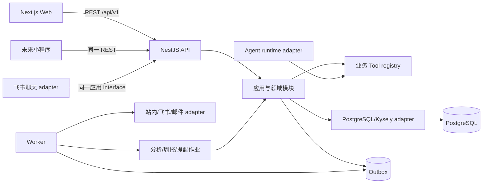

# AI 客户作战系统 V1 系统架构与详细设计

> 状态：V1 实施基线
>
> 更新日期：2026-08-31
>
> 目标：规定模块 seam、技术栈、接口、事务、异步任务、Agent/Tool、权限、通知、配置、观测、部署和测试，使 Web、未来小程序、Agent 框架和外部渠道都能替换而不改写业务核心。

## 1. 架构结论

V1 采用模块化单体和三进程部署：Next.js Web、NestJS API、异步 Worker，共用 PostgreSQL。业务模块与基础设施 adapter 在代码内分离，但不提前拆微服务。



硬约束：

1. Agent 不获得数据库连接或任意 SQL；
2. Web、Bot 和 Worker 都只能调用同一应用 interface；
3. 正式业务写入由确定性事务完成，模型输出只能形成候选；
4. PostgreSQL 是正式事实源，投影和外部通知均可重建或重试；
5. 外部渠道、模型或 Agent runtime 故障不能破坏核心 Web 闭环。

## 2. 方案比较

### 方案 A：模块化单体 + PostgreSQL Outbox（采用）

优点：事务边界清晰、运维对象少、适合当前团队与试点规模；模块 seam 和三进程部署仍允许未来独立扩缩。缺点：需要持续守住模块依赖，不能把所有代码堆进 API controller。

### 方案 B：微服务 + 消息队列

优点：服务可独立扩缩和发布。缺点：在业务边界、规模和团队尚未稳定时引入分布式事务、消息治理和多套部署，首期成本显著高于收益。V1 不采用。

### 方案 C：前端直连 BaaS + Serverless Functions

优点：演示开发快。缺点：权限、复杂确认事务、Agent Tool、Outbox 和自有服务器部署会受平台约束，也容易让领域规则散落到客户端和数据库函数。V1 不采用；未来仍可把托管 PostgreSQL 当普通基础设施使用。

## 3. 技术选型

| 层 | 选择 | 使用边界 |
|---|---|---|
| 运行时 | Node.js 24、TypeScript ESM | 仓库统一运行时，锁定小版本范围 |
| Web | Next.js 16 App Router、React | 只负责页面、交互和 API client，不承载正式领域写入 |
| API | NestJS 12 | HTTP、认证 adapter、依赖装配和模块入口 |
| 契约 | Zod + 版本化 DTO | 请求、响应、事件和 Tool schema；禁止把数据库行直接作为响应 |
| 数据库 | PostgreSQL 17+ | 正式事实、投影、Outbox、任务与配置版本 |
| 查询 adapter | Kysely + `pg` | 仅基础设施层；复杂约束保留原生 SQL |
| 迁移 | 版本化 SQL migration | 只前向追加；空库重建和真实 PostgreSQL CI 验证 |
| 异步任务 | PostgreSQL Outbox + `for update skip locked` | V1 不引入 Redis/Kafka；出现明确吞吐瓶颈再替换 adapter |
| 认证 | 标准 OIDC/JWT adapter + 本地开发身份 | 不绑定具体 IdP；生产必须配置签名校验和 issuer/audience |
| 文件 | S3 兼容对象存储 adapter | 附件和大证据；数据库只保存元数据、hash 和引用 |
| 观测 | OpenTelemetry interface + 结构化日志 | Trace ID 贯穿 HTTP、Agent、Tool、事务、任务和投递 |

### 3.1 数据访问选择

SQL migration 是 schema 事实源，Kysely 负责类型化查询和事务。Drizzle 的迁移体系正在版本换代，Prisma 8 当前迁移能力仍有官方列出的早期限制；两者都不是业务核心可见的 interface。Kysely adapter 可以被原生 `pg` 或其他查询库替换，应用模块不受影响。

### 3.2 不引入的基础设施

- 不首期引入 Redis、Kafka、Elasticsearch、工作流引擎或向量数据库；
- 不为尚未出现的超大数据量做分区；
- 不让 GraphQL、Server Actions 或前端 SDK 成为唯一业务入口；
- 不建设通用自定义字段、低代码流程或任意 SQL 平台。

## 4. 仓库结构目标

```text
apps/
  web/                    # 页面与 REST client
  api/                    # HTTP、认证和依赖装配
  worker/                 # Outbox、分析、提醒、通知、周报作业
packages/
  contracts/              # REST、事件和 Tool schemas
  core/                   # 领域与应用模块，框架无关
  database/               # SQL migrations、Kysely types/adapters、DB tests
  auth/                   # ActorContext、授权 interface 与 adapters
  agent-runtime/          # Agent provider adapters、Tool registry
  notifications/          # 站内/飞书/邮件 adapters
docs/
  adr/                    # 难以逆转的架构决定
```

包数量随真实代码增加，不先创建空壳。`packages/core` 可以按领域目录分模块，但公共导出保持小 interface。

## 5. 模块与依赖

| 模块 | 拥有的数据/规则 | 对外 interface |
|---|---|---|
| Identity & Access | 用户、团队、membership、ActorContext、数据范围 | `resolveActor`、`authorize` |
| Customer Operations | 经营对象、联系人任职、责任关系 | 查询对象、变更责任、对象时间线 |
| Opportunities | 商机、阶段当前值和历史 | 创建/更新商机、应用阶段变化 |
| Follow-up Confirmation | 来源、草稿、revision、确认事务、事实和证据 | 创建草稿、修改草稿、确认、取消 |
| Battle Analysis | 信号、分析运行、作战状态版本和当前投影 | 请求分析、提交结果、查询地图 |
| Actions | 建议动作、正式动作、状态历史 | 接受/拒绝建议、改期、转派、完成 |
| Reports & Queries | 周报版本、受控管理查询 | 生成/审阅/发布报告、执行受控查询 |
| Notifications | 站内事件、渠道投递与模板 | 读取收件箱、投递、重试 |
| Runtime Governance | 规则、Prompt、模型、Agent/Tool 运行、审计、导入 | 草稿/发布/回滚、运行查询、导入 |

依赖方向：HTTP/Worker adapter → 应用模块 → 领域模型；数据库、模型、对象存储和通知 adapter 指向应用定义的 seam。领域模块之间通过应用 interface 或领域事件协作，不相互读取私有表。

## 6. 身份、权限与租户

### 6.1 ActorContext

```ts
interface ActorContext {
  tenantId: string;
  userId: string;
  roleCodes: string[];
  orgUnitIds: string[];
  channel: "web" | "feishu" | "system";
  requestId: string;
}
```

生产 ActorContext 只能来自已验证的 OIDC/JWT 或受信系统任务，不接受客户端直接提交 `tenantId`/`userId` 请求头。开发身份 adapter 仅在显式开发模式启用，生产启动时检测到它必须失败。

### 6.2 授权决策

首期使用角色 + 数据范围 + 对象责任关系：

- 销售：本人负责/协作的经营对象、商机、动作和本人报告；
- 管理者：授权组织单元及下级范围；
- 管理关注人：仅获得显式关注对象的读取与指定介入权限；
- 管理员：配置和运行治理，不默认拥有全部业务证据正文；
- 系统任务：按任务类型使用最小权限，不伪装成人类用户。

应用模块在进入 repository 前执行授权；数据库 RLS 再按租户隔离。权限拒绝统一返回 `404` 或受控 `403`，避免泄露对象存在性。

## 7. REST 契约

### 7.1 通用规则

- 基础路径 `/api/v1`；破坏性变更发布新主版本；
- 请求和响应都由 Zod strict schema 校验；
- 创建/确认/状态变化要求 `Idempotency-Key`；
- 更新要求 `If-Match` 或显式 `versionNo`；
- 列表使用不透明游标，默认 20、最大 100；
- 时间统一 ISO 8601 UTC；金额使用字符串或最小货币单位，不使用 JSON 浮点；
- 错误使用稳定 `code`、用户可理解 `message`、`requestId` 和可选字段级 `issues`。

### 7.2 错误结构

```json
{
  "code": "DRAFT_VERSION_CONFLICT",
  "message": "草稿已被其他操作更新，请比较最新版本后重试。",
  "requestId": "req_...",
  "issues": [
    { "path": "versionNo", "reason": "expected 3, received 2" }
  ]
}
```

### 7.3 V1-A 端点

| 方法与路径 | 用途 |
|---|---|
| `POST /followup-drafts` | 从原始输入生成候选草稿 |
| `GET /followup-drafts/:id` | 查询草稿、revision 和来源 |
| `PATCH /followup-drafts/:id` | 修改待确认候选 |
| `POST /followup-drafts/:id/confirm` | 幂等确认并写正式跟进 |
| `POST /followup-drafts/:id/cancel` | 取消草稿 |
| `GET /entities` / `GET /entities/:id` | 对象列表与详情 |
| `GET /entities/:id/timeline` | 时间线游标查询 |
| `GET /battle-map` | 地图投影、T0、KPI 和变化摘要 |
| `GET /action-proposals` | 待确认建议 |
| `POST /action-proposals/:id/accept` | 创建正式经营动作 |
| `POST /action-proposals/:id/reject` | 拒绝并记录原因 |
| `PATCH /actions/:id` | 改期、转派或编辑允许字段 |
| `POST /actions/:id/transition` | 状态转换 |
| `GET /inbox` / `POST /inbox/:id/read` | 站内通知 |

### 7.4 V1-B 端点

| 方法与路径 | 用途 |
|---|---|
| `POST /management-queries` | 执行受控管理问数 |
| `POST /reports/generate` | 请求个人/团队周报 |
| `GET /reports/:id` | 查询草稿或发布版本 |
| `POST /reports/:id/submit-review` | 提交审阅 |
| `POST /reports/:id/publish` | 发布不可变版本 |
| `POST /imports` | 创建导入批次 |
| `GET /imports/:id` | 查询校验和失败行 |
| `POST /imports/:id/commit` | 幂等提交已校验数据 |

## 8. Agent 与 Tool 设计

### 8.1 AgentRuntime seam

```ts
interface AgentRuntime {
  run<TInput, TOutput>(request: {
    capability: string;
    input: TInput;
    outputSchema: unknown;
    toolset: Toolset;
    configVersionId: string;
    traceContext: TraceContext;
  }): Promise<AgentRunResult<TOutput>>;
}
```

实现至少包括确定性 adapter（开发、回放和测试）以及一个标准模型 provider adapter。应用模块只接收结构化候选，不理解 provider SDK。

### 8.2 Tool interface

```ts
interface BusinessTool<TInput, TOutput> {
  name: string;
  inputSchema: unknown;
  outputSchema: unknown;
  execute(actor: ActorContext, input: TInput): Promise<TOutput>;
}
```

Tool 是业务语义，不是表 CRUD。首批 Tool：

- `search_business_entities`；
- `get_entity_context`；
- `get_opportunity_context`；
- `propose_followup_draft`；
- `query_sales_progress`；
- `request_battle_analysis`。

正式确认、状态转换和配置发布不开放给无人值守 Agent。未来提高自治等级时必须新增明确审批策略，不复用任意写 Tool。

### 8.3 运行记录

每次 Agent 运行记录 capability、ActorContext 摘要、输入版本、Prompt/模型/规则版本、Tool 调用摘要、结构化输出 hash、耗时、token/成本、状态和错误。敏感原文进入证据存储，运行日志只留受控摘要。

## 9. 业务事务与领域事件

### 9.1 确认跟进

确认接口先执行 schema、权限、幂等和版本校验，再调用一个深的 `confirmFollowup` interface。该模块在单事务内写跟进、事实、证据关联、审计、领域事件和 Outbox；任何一步失败全部回滚。商机阶段和建议动作属于对已确认事实的后续分析结果，不混入本次人工事实确认事务。

当前已实现的跟进确认增量刻意缩小了事务职责：Agent 在事务外生成候选；确认事务按固定顺序锁定草稿、经营对象和关联商机，原子写入正式跟进、参与人/商机关联、事实/证据、审计、`followup.confirmed.v1` 领域事件、幂等结果和一条待处理 Outbox。商机阶段历史由后续规则/分析增量消费已确认事实后生成；建议动作进入独立候选与二次确认事务，当前确认接口不会直接创建动作或提醒。这样既保留目标架构，也避免把尚未实现的自动推断写入正式事实事务。

事件示例：

- `followup.confirmed.v1`；
- `opportunity.stage_changed.v1`；
- `action.proposed.v1`；
- `battle_state.changed.v1`；
- `action.due.v1`；
- `weekly_report.published.v1`。

事件 payload 只包含稳定 ID、版本和最小路由信息；消费者通过授权的查询 interface 获取详情。

### 9.2 Outbox 消费

Worker 每批领取有限数量的待处理消息，使用 `for update skip locked` 防止重复领取。每个消费者保存幂等结果；失败采用指数退避和最大次数，超过阈值进入人工重试队列。Outbox 发布至少一次，消费者必须幂等。

## 10. 作战分析

1. 正式事实提交后创建带 `input_version` 的分析请求；
2. 确定性规则先计算可解释信号；
3. Agent 可补充摘要、缺口和建议，但不能改变原始事实；
4. 输出经 schema 与规则校验后写入不可变作战状态版本；
5. 更新当前投影前比较输入版本，旧运行标记为 `superseded`；
6. 位置或风险达到已发布“关键变化”规则时生成通知事件。

分数、阈值和象限来自已发布规则版本。数据不足时输出 `data_sufficiency` 与缺口，不强行给精确分数。

## 11. 提醒、周报与管理问数

### 11.1 提醒

提醒策略版本包含适用动作、提前量、到期节点、逾期频率、停止条件、升级对象和渠道偏好。改期时取消未执行实例并按当前发布策略重建；同一动作、策略版本、接收人和提醒节点生成稳定去重键。

### 11.2 周报

生成作业读取统一投影和事实证据，先产生结构化项目，再由模板/Agent 生成可读摘要。默认进入 `in_review`，发布后不可变。调度时间和是否自动发布都是版本化策略。

### 11.3 管理问数

自然语言只解析为受控查询模板与参数，不生成任意 SQL。授权过滤先于汇总；结果返回口径、截止时间、数据范围、结构化指标、对象引用、证据和缺口。

## 12. 通知架构

站内通知是用户可查询的事实记录；飞书和邮件是投递 adapter。

```text
领域事件 → 通知规则 → notification_event
  → inbox delivery
  → feishu delivery
  → email delivery
```

- 模板以版本发布，卡片深链只指向独立 Web；
- 渠道地址与用户分离，支持换 open_id、邮箱或禁用渠道；
- 外部发送结果保存 provider message ID、尝试次数和错误摘要；
- 飞书不可用时站内通知照常，失败投递可重试或切换邮件；
- CLI 只用于开发调试，不作为生产通知 runtime。

## 13. 配置发布

规则、Prompt、模型和通知模板统一使用：

```text
draft → validated → published → deprecated
```

- 草稿可以修改，已发布版本不可修改；
- 发布前运行 schema 校验、样例回放和权限检查；
- 新版本带 `effective_at`，运行记录保存实际命中的版本 ID；
- 回滚是重新发布历史内容为新版本，不改变旧运行记录；
- 密钥只保存 secret reference，不进入配置正文、日志或 Git。

## 14. 可观测性与审计

### 14.1 结构化日志

每条日志包含 `timestamp`、`level`、`service`、`request_id`、`trace_id`、`tenant_id`、`actor_id`、`operation`、`result`、`duration_ms` 和错误码。原始跟进、联系人隐私和附件正文默认不记录。

### 14.2 指标

- HTTP 成功率、P50/P95/P99 延迟；
- 草稿生成、确认、冲突和取消率；
- Agent/Tool 成功率、耗时、token 与成本；
- Outbox 积压、任务延迟、重试和死信；
- 通知各渠道成功率；
- 作战分析新鲜度；
- 周报准时生成与发布率；
- 数据不足和权限拒绝率。

### 14.3 审计

正式业务对象、权限、配置发布、导入、人工重试和管理员查询均写审计。审计记录追加式保存，记录对象版本、变更摘要、操作者、入口、原因和关联 request/trace ID；敏感字段以 hash 或脱敏差异表达。

## 15. 部署拓扑

### 15.1 最小正式部署

- 反向代理/TLS；
- 2 个可独立扩展的 Web/API 实例；
- 1 个 Worker 实例，使用数据库锁保证单任务幂等；
- PostgreSQL 主库与每日备份；
- S3 兼容对象存储；
- 日志、指标和告警接收端；
- OIDC 身份提供方与飞书/邮件凭据。

### 15.2 环境

`development`、`test`、`staging`、`production` 使用独立数据库和密钥。生产禁止开发身份、确定性假 Agent 和自动建表。migration 在发布前单独运行，应用启动只检查 schema 兼容版本。

### 15.3 备份与恢复默认目标

在用户提供正式基础设施指标前，V1 设计目标为：每日全量备份 + 持续 WAL/PITR（由数据库平台能力决定），RPO 不高于 24 小时、RTO 不高于 8 小时。上线前必须用一次真实恢复演练替换纸面承诺。

## 16. 测试策略

| 层 | 证明内容 |
|---|---|
| 契约测试 | DTO、事件和 Tool schema 的兼容性与拒绝路径 |
| 领域/应用测试 | 状态机、不变量、权限决策、幂等和版本冲突 |
| 数据库迁移测试 | 空库迁移、复合租户外键、RLS、部分唯一索引和约束 |
| Repository 集成测试 | Kysely adapter 对真实 PostgreSQL 的查询与事务 |
| API 端到端 | 认证、授权、错误结构、确认事务和游标分页 |
| Worker 集成 | Outbox 并发领取、重试、死信、通知去重和旧分析抑制 |
| Web 组件测试 | 所有状态、键盘交互和关键表单行为 |
| 浏览器端到端 | 销售、管理者、管理员的核心旅程与 390px/桌面响应式 |
| 回放/Eval | Prompt/模型版本在固定合成数据集上的结构化正确率与安全边界 |
| 安全测试 | 越权、跨租户、敏感日志、输入限制和依赖漏洞 |

所有功能按红—绿—重构实现。CI 使用真实 PostgreSQL 18 服务验证 PostgreSQL 17+ 兼容 SQL，不用纯 mock 代替数据库约束；本地可使用单进程嵌入式 PostgreSQL 运行常规迁移测试。

## 17. 非功能验收基线

- 常规读取 P95 小于 500ms，正式确认事务 P95 小于 1s（不含 Agent 调用）；
- Agent 和外部通知均有明确超时、取消、重试和熔断边界；
- 任何跨租户读取/写入测试必须失败；
- 重复确认、重复事件和重复投递不产生重复正式记录；
- 单个外部渠道故障不降低核心 API 可用性；
- 关键页面 390–1440px 可用，核心流程键盘可完成；
- 公开仓库扫描不得出现凭据、客户数据、私有协作链接或内部证据。

## 18. 演进条件

只有出现以下证据才拆服务或增加基础设施：

- Worker 负载影响 API 延迟且独立扩缩能解决；
- Outbox 吞吐或保留超过 PostgreSQL 可接受范围；
- 搜索需求经测量无法由 PostgreSQL 索引/全文检索满足；
- 领域模块由独立团队维护并需要独立发布；
- 单表规模与运维窗口达到分区门槛。

拆分时保留现有应用 interface 和事件契约，先移动 adapter/实现，不让客户端感知内部部署变化。

## 19. 实施顺序

1. 数据库基础、ActorContext 与租户隔离；
2. 经营对象/联系人/商机主数据；
3. 跟进草稿扩展与确认事务；
4. 作战分析、地图和建议动作确认；
5. Outbox、站内通知和飞书 adapter；
6. 提醒、周报和管理问数；
7. 配置、导入、审计和运行治理；
8. 部署、恢复、安全和全链路验收。

每一步都形成可运行纵向切片，完成测试、文档、浏览器验收和 `main` CI 后再进入下一步；阶段完成不代表整个 V1 完成。

## 20. 参考资料

- [PostgreSQL 18 Constraints](https://www.postgresql.org/docs/current/ddl-constraints.html)
- [PostgreSQL Row Security Policies](https://www.postgresql.org/docs/current/ddl-rowsecurity.html)
- [PostgreSQL Explicit Locking](https://www.postgresql.org/docs/current/explicit-locking.html)
- [Kysely documentation](https://kysely.dev/)
- [Drizzle migrations](https://orm.drizzle.team/docs/migrations)
- [Prisma migrations](https://www.prisma.io/docs/orm/migrations)
